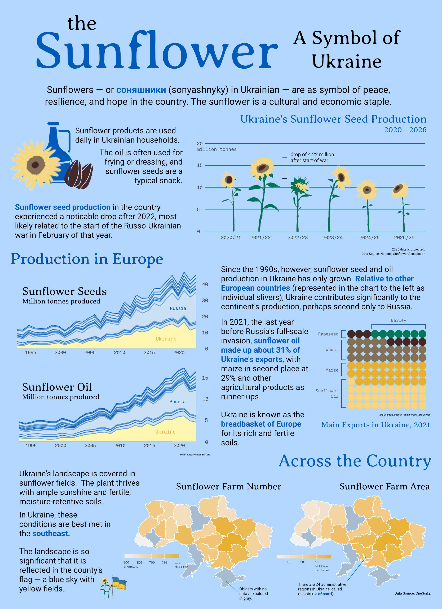

# Ukrainian Sunflowers

This repository contains the code to make the charts embedded within the following infographic:



Being Ukrainian myself, I intended to make this infographic a celebration of Ukrainian culture, as well as a highlight of its influence on the European economy. A full description of my thought process can be found on [my personal website blog](https://sofiasarak.github.io/blog/ukrainian-sunflowers-infographic/).

## Data Sources:
- **Yearly Sunflower Seed Production:** [National Sunflower Association](https://www.sunflowernsa.com/stats/world-supply/)
- **Sunflower Seed and Oil Output, Across Europe:** [Our World in Data](https://ourworldindata.org/search?q=sunflower)
- **Ukraine's Export Values in 2021:** [European Parliament's briefing on Ukrainian agriculture](https://www.europarl.europa.eu/RegData/etudes/BRIE/2024/760432/EPRS_BRI\(2024\)760432_EN.pdf#)
- **Size and Number of Sunflower Farms Across Ukraine:** [OneSoil.ai](https://map.onesoil.ai/2020/UKR#4.24/47.26/34.38)
- **Shapefile of Ukraine:** [Eugene Borshch's GitHub repository](https://github.com/EugeneBorshch/ukraine_geojson)

## Repository Structure

This repository contains .qmd documents for the intermediary steps associated with the [accompanying assignments](https://eds-240-data-viz.github.io/assignments.html). The most final versions of each of the plots can be found in `drafting_viz.qmd`.
```
├── data
│   ├── agricultural-land
│   ├── all_areas.csv
│   ├── by_region.csv
│   ├── production-of-sunflower-oil
│   │   ├── production-of-sunflower-oil.csv
│   │   ├── production-of-sunflower-oil.metadata.json
│   │   └── readme.md
│   ├── sunflower-seed-production.csv
│   ├── UA_FULL_Ukraine.geojson
├── drafting-viz.qmd
├── exploration.pdf
├── exploration.qmd
├── images
│   ├── choropleth1.png
│   ├── choropleth2.png
│   ├── handdrawn_plots.png
│   ├── handdrawn_plots2.jpg
│   ├── image_barplot.png
│   ├── infographic.jpg
│   ├── sunflower1.png
│   └── sunflower2.png
└── README.md
```
## Course Information

-   **Course Title:** [EDS 240 - Data Visualization & Communication](https://eds-240-data-viz.github.io/)
-   **Term:** Winter 2026
-   **Program:** [UCSB Masters in Environmental Data Science](https://bren.ucsb.edu/masters-programs/master-environmental-data-science).

Teaching Team:

-   **Instructor:** [Sam Shanny-Csik](https://github.com/samanthacsik)
-   **Co-Instructor:** [Annie Adams](https://github.com/annieradams)

Complete materials for this homework assignment can be found on the [course website](https://eds-240-data-viz.github.io/course-materials/assignments/HW1.html).

*This README was adapted from the README template provided in EDS220; see course details and original repository [here](https://github.com/sofiasarak/eds220-2025-in-class).*
