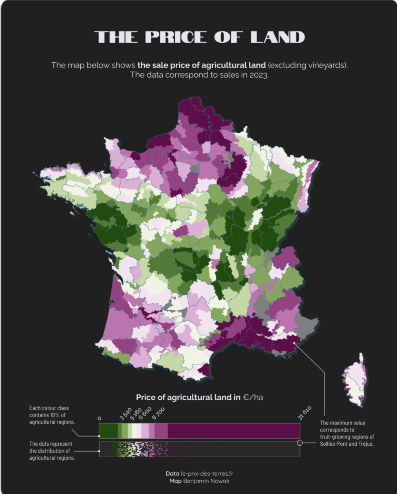
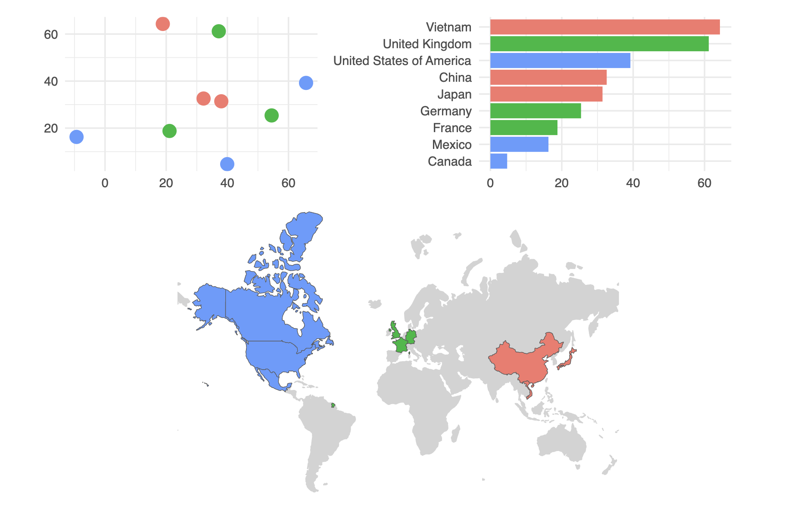
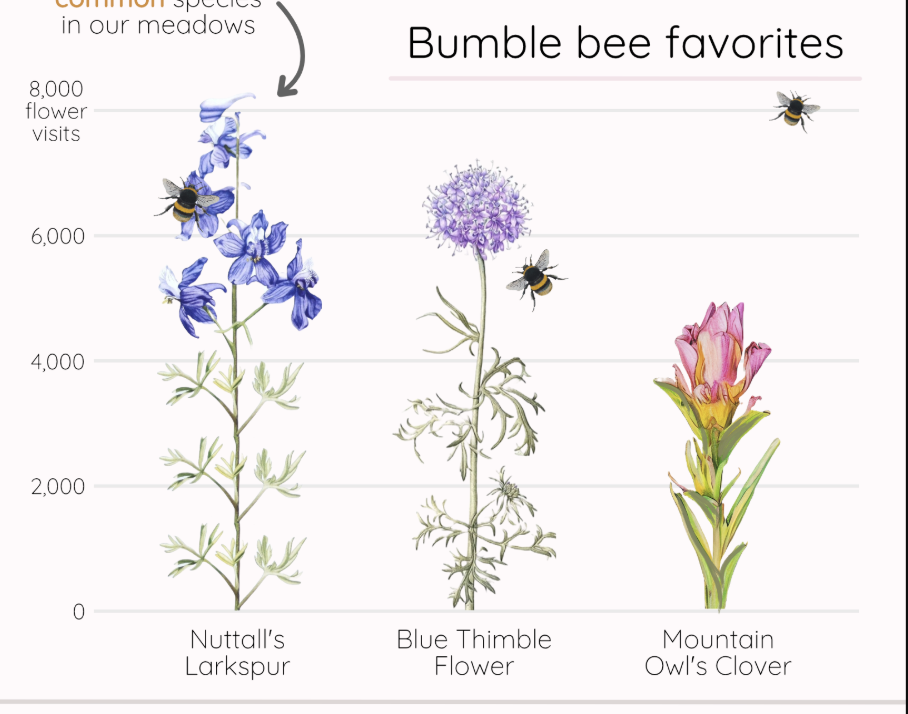

## Pre-Planning

**1. Restate the questions you hope to answer with your infographic. This should include one overarching question (think of this as driving the overall theme of your infographic) and at least three subquestions (each of which will be addressed by your infographic’s component visualizations). Have these questions changed at all since FPM #1? If yes, how so?**

Overarching question: Sunflowers are a significant part of Ukrainian culture, but how important are they to and how do they emerge across the country's agricultural economy?
- Subquestion #1: How does Ukrainian sunflower oil and seed production compare to that of other European countries?
- Subquestion #2: How has Ukraine's sunflower crop production changed over time? 
- Subquestion #3: How does sunflower production compare across different areas of Ukraine?

**2. Explain which variables from your data set(s) you will use to answer the above questions, and how.**

I have data on sunflower seed and oil production (in tonnes) for all European countries. Using this data, I will create an area chart that conveys the significance of Ukraine's contribution to the overall market. Using the same data but filtered for just Ukraine's production, I will show the change in the country's production over time using a bar plot. Finally, with data on the number and size (in acres) of sunflower farms across Ukraine's oblasts (political units, equivalent to states), I will map the prevelance of sunflower agriculture in the country itself.

**3. In FPM #2, you created some exploratory data viz to better understand your data. You may already have some ideas of how you plan to formally visualize your data, but it’s incredibly helpful to look at visualizations by other creators for inspiration. Find at least two data visualizations that you could (potentially) borrow / adapt pieces from. Download and embed them into your drafting-viz.qmd file, and explain which elements you might borrow (e.g. the graphic form, legend design, layout, etc.).**

Choropleth Maps:

I like the following two choropleth examples that I found in the [R Graph Gallery](https://r-graph-gallery.com/choropleth-map.html). In the first, I liked how they formatted the map legend. Not only do I see myself borrowing the horizontal legend, but I also like the look of the angled labels. Finally, I was intrigued by the inclusion of a distribution dot plot paired with the legend. I'm not sure if it will be as effective with my data, but I am looking forward to trying.


In this second choropleth map, I liked the addition of the bar and scatter plots that visualize the same data in a different way. I wonder if I could categorize Ukraine's oblasts into geographic regions, and borrow this approach to highlight which areas and climates produce the most sunflowers.



Bar Graph:

This chart from [name name MEDS '25 Final Project] uses images of flowers to show difference in value, instead of the traditional bars. I hope to adapt this approach, and do the same (but with sunflowers) for my graph that shows Ukraine's change in sunflower production over time.



## Hand-drawn Anticipated Visualizations

Hand-draw your anticipated visualizations, then take a photo of your drawing(s) and embed it in your rendered drafting-viz.qmd file – note that these are not exploratory visualizations, but rather your plan for your final visualizations that you will eventually polish and include in your infographic.

## Recreation of Hand-Drawn Visualizations
Mock up all of your hand drawn visualizations using code. We understand that you will continue to iterate on these into FPM #4 (particularly after receiving feedback), but by the end of FPM #3, you should:
- have your data plotted (if you’re experimenting with a graphic form(s) that was not explicitly covered in class, we understand that this may take some more time to build; you should have as much put together as possible)
- use appropriate strategies to highlight / focus attention on a clear message
include appropriate text such as titles, captions, axis labels (note: you may eventually convert some text, such as titles and captions, into annotations or text elements on your infographic; it’s still helpful to include titles, etc. on these stand-alone visualizations now, to provide your peer reviewers and instructional team with necessary context)
- experiment with colors and typefaces / fonts
- create a presentable / aesthetically-pleasing theme (e.g. (re)move gridlines / legends as appropriate, adjust font sizes, etc.)


Prepare necessary components for visualizations
```{r}
#| message: false
#| warning: false

# Load necessary libraries
library(tidyverse)
library(here)
library(ggplot2)
library(janitor)
library(gghighlight)
library(patchwork)
library(showtext)
```

```{r}
#| message: false

## Load sunflower production data

# create vector of only European countries
europe_countries <- c("Albania", "Andorra", "Austria", "Belarus", "Belgium", 
"Bosnia and Herzegovina", "Bulgaria", "Croatia", "Cyprus", "Czech Republic", 
"Denmark", "Estonia", "Finland", "France", "Germany", "Greece", "Hungary", 
"Iceland", "Ireland", "Italy", "Kazakhstan", "Kosovo", "Latvia", 
"Liechtenstein", "Lithuania", "Luxembourg", "Malta", "Moldova", 
"Monaco", "Montenegro", "Netherlands", "North Macedonia", "Norway", 
"Poland", "Portugal", "Romania", "Russia", "San Marino", "Serbia", 
"Slovakia", "Slovenia", "Spain", "Sweden", "Switzerland", "Turkey", 
"Ukraine", "United Kingdom", "Vatican City")

# sunflower oil
sunflower_oil <- read_csv(here("data", "production-of-sunflower-oil", "production-of-sunflower-oil.csv")) %>% 
  clean_names() %>% 
   filter(entity %in% europe_countries) %>% 
  
  # Add a column to denote when the observation is for Ukraine
  mutate(is_ua = case_when(
    entity == "Ukraine" ~ 1,
    TRUE ~ 0
  ))

# sunflower seeds
sunflower_seeds <- read_csv(here("data", "sunflower-seed-production.csv")) %>% 
  clean_names() %>% 
   filter(entity %in% europe_countries) %>% 
  
  # Add a column to denote when the observation is for Ukraine
  mutate(is_ua = case_when(
    entity == "Ukraine" ~ 1,
    TRUE ~ 0
  ))

## Farms by region data

# Load data and join attributes to geometries

# Ukraine geometry
oblasts <- read_sf("data/UA_FULL_Ukraine.geojson")
# Atttributes
by_region <- read_csv(here("data/by_region.csv")) %>% 
  mutate("name:en" = Region)

# Join on oblast name
sunflower_region <- left_join(oblasts, by_region, by = "name:en")


## Sunflower production data
sunflower_prod <- tribble(
  ~year, ~prod,
  "2020/21", 13900 * 1000,
  "2021/22", 16900 * 1000,
  "2022/2023", 12680 * 1000,
  "2023/2024", 15100 * 1000,
  "2024/2025", 12100 * 1000,
  "2025/2026", 11400 * 1000
)
```

```{r}
# Load theme fonts
font_add_google(name = "Geist Mono", family = "geist_mono")
font_add_google(name = "Averia Serif Libre", family = "libre")
font_add_google(name = "Roboto", family = "roboto")

# Save theme colors
dark_yellow <- "#E7B030"
light_yellow <- "#f7d481"
uki_blue <- "#005BBB"
light_blue <- "#cbe1f5"

platinum <- "#F0F1F3"
inferno <- "#A30100"
honey_bronze <- "#F5AC45"
baltic_blue <- "#015E7C"
tropical_teal <- "#00AFB5"
```


```{r}
#| echo: false
# avoid exponential notation in y-axis
options(scipen = 999)

showtext_auto(enable = TRUE)

sunflower_oil |> 
    filter(year > 1992) %>% 
  ggplot(aes(x = year, y = sunflower_oil_production_tonnes, group = entity, 
             fill = as.factor(is_ua))) +
  geom_area(color = alpha(uki_blue, alpha = 0.5), linewidth = 0.5) +
  labs(x = " ",
       title = "Tonnes of Sunflower Oil Produced in Europe",
       y = " ",
       subtitle = "Other than Russia, Ukraine has only grown as the highest producer of sunflower\noil over the past few decades.",
       caption = "Data Source: ") +
  theme_minimal(base_size = 17) +
  scale_fill_manual(values = c(light_blue, light_yellow)) +
  theme(panel.grid = element_blank(),
        legend.position = "none",
        plot.title = element_text(family = "libre",
                                  size = rel(0.99),
                                  margin = margin(b = 7)),
        plot.subtitle = element_text(family = "roboto", size = rel(0.70)),
        axis.text.y = element_text(hjust = 0, family = "geist_mono", size = rel(0.65)),
        axis.text.x = element_text(family = "geist_mono", size = rel(0.65)),
         plot.caption = element_text(family = "roboto",
                                    margin = margin(t = 20),
                                    size = rel(0.45)),
        plot.caption.position = "plot") +
  scale_y_continuous(position = "right") +
   scale_x_continuous(breaks = c(1995, 2000, 2005, 2010, 2015, 2020))

showtext_auto(enable = FALSE)
```

```{r}
showtext_auto(enable = TRUE)

sunflower_seeds |> 
    filter(year > 1992) %>% 
  ggplot(aes(x = year, y = sunflower_seeds_production_tonnes, group = entity, 
             fill = as.factor(is_ua))) +
  geom_area(color = alpha(uki_blue, alpha = 0.5), linewidth = 0.5) +
  labs(x = " ",
       title = "Tonnes of Sunflower Seeds Produced in Europe",
       y = " ",
       subtitle = "Other than Russia, Ukraine has only grown as the highest producer of sunflower\nseeds over the past few decades.",
       caption = "Data Source: ") +
  theme_minimal(base_size = 17) +
  scale_fill_manual(values = c(light_blue, light_yellow)) +
  theme(panel.grid = element_blank(),
        legend.position = "none",
        plot.title = element_text(family = "libre",
                                  size = rel(0.99),
                                  margin = margin(b = 7)),
        plot.subtitle = element_text(family = "roboto", size = rel(0.70)),
        axis.text.y = element_text(hjust = 0, family = "geist_mono", size = rel(0.65)),
        axis.text.x = element_text(family = "geist_mono", size = rel(0.65)),
        plot.caption = element_text(family = "roboto",
                                    margin = margin(t = 20),
                                    size = rel(0.45)),
        plot.caption.position = "plot") +
  scale_y_continuous(position = "right") +
   scale_x_continuous(breaks = c(1995, 2000, 2005, 2010, 2015, 2020))

showtext_auto(enable = FALSE)
```

```{r}
showtext_auto(enable = TRUE)

ggplot(sunflower_prod, aes(x = year, y = prod)) +
  geom_col(width = 0.05) +
  scale_y_continuous(expand = expansion(mult = c(0, 0.3))) +
  theme_minimal(base_size = 17) +
  labs(title = "Ukraine's Sunflower Seed Production Over Time",
       subtitle = "Production is variable, with an observed decline after the start of the\nfull-scale Russian invasion in 2022.",
       x = " ",
       y = "Tonnes",
       caption = "Data Source: ") +
  theme(panel.grid.major.x = element_blank(),
        legend.position = "none",
        plot.title = element_text(family = "libre",
                                  size = rel(0.99),
                                  margin = margin(b = 7)),
        plot.subtitle = element_text(family = "roboto", size = rel(0.70)),
        axis.text.y = element_text(hjust = 0, family = "geist_mono", size = rel(0.65)),
        axis.text.x = element_text(family = "geist_mono", size = rel(0.65)),
        axis.title = element_text(family = "roboto", size = rel(0.7)),
        plot.caption = element_text(family = "roboto",
                                    margin = margin(t = 20),
                                    size = rel(0.45)),
        plot.caption.position = "plot")

showtext_auto(enable = FALSE)
```


## Choropleth

```{r}
showtext_auto(enable = TRUE)

ggplot(data = sunflower_region) +
  geom_sf(aes(fill = Number), color = "white") +
  labs(title = "Number of sunflower farms by oblast",
       subtitle = "There tend to be more sunflower farms in southeast Ukraine,\npossibly due to warmer climate.",
       fill = " ",
       caption = "Data Source: OneSoil.ai") +
  guides(fill = guide_colorbar( #direction = "horizontal",
                               title.position = "top",
                               barheight = 8)) +
   theme_void(base_size = 17) +
  # theme(legend.position = "bottom") +
  scale_fill_continuous(high = "#E7B030", low = platinum, na.value = "#cbe1f5",
                        labels = scales::label_number(scale = 1e-5, suffix = " million")) +
  theme(plot.margin = margin(t = 1, r = 1, b = 1, l = 1, unit = "cm"),
        plot.title = element_text(family = "libre",
                                  size = rel(0.99),
                                  margin = margin(b = 7)),
        plot.subtitle = element_text(family = "roboto", size = rel(0.70),
                                     margin = margin(b = 5)),
        legend.text = element_text(family = "geist_mono",
                                   size = rel(0.55)),
        plot.caption = element_text(family = "roboto",
                                    margin = margin(t = 20),
                                    size = rel(0.45)),
        plot.caption.position = "plot") +
  
  # add no data legend
  annotate("rect", xmin = 38.5, xmax = 39.5, ymin = 45.6, ymax = 45.9, fill = "#cbe1f5") +
  annotate("text", x = 38.5, y = 45.3, label = "No Data", hjust = 0, size = 3.1, family = "geist_mono")

showtext_auto(enable = FALSE)
```


```{r}
showtext_auto(enable = TRUE)


ggplot(data = sunflower_region) +
  geom_sf(aes(fill = Size), color = "white") +
  labs(title = "Size of sunflower farms in hectares",
       subtitle = "Sunflower farms tend to cover more area in southeast Ukraine,\npossibly due to warmer climate.",
       fill = " ",
       caption = "Data Source: OneSoil.ai") +
  guides(fill = guide_colorbar( #direction = "horizontal",
                               title.position = "top",
                               barheight = 8)) +
   theme_void(base_size = 17) +
  scale_fill_continuous(high = "#E7B030", low = platinum, na.value = "#cbe1f5",
                        labels = scales::label_number(scale = 1e-5, suffix = " million")) +
  theme(plot.margin = margin(t = 1, r = 1, b = 1, l = 1, unit = "cm"),
        plot.title = element_text(family = "libre",
                                  size = rel(0.99),
                                  margin = margin(b = 7)),
        plot.subtitle = element_text(family = "roboto", size = rel(0.70),
                                     margin = margin(b = 5)),
        legend.text = element_text(family = "geist_mono",
                                   size = rel(0.55)),
        plot.caption = element_text(family = "roboto",
                                    margin = margin(t = 20),
                                    size = rel(0.45)),
        plot.caption.position = "plot") +
  
  # add no data legend
  annotate("rect", xmin = 38.5, xmax = 39.5, ymin = 45.6, ymax = 45.9, fill = "#cbe1f5") +
  annotate("text", x = 38.5, y = 45.3, label = "No Data", hjust = 0, size = 3.1, family = "geist_mono")


showtext_auto(enable = FALSE)
```


## Final Questions

**1. What are the key insights you want your infographic to communicate, and how will your design choices help highlight and support those messages?**

I want my ifnographic to communicate both the cultural and economic importance of sunflowers to Ukraine. Whereas my data will help highlight the country's role in the agricultural sector, I hope that my inclusion of sunflower imagery throughout the infographic (such as using them as bars in the bar chart, as well as emebellishments throughout) will help develop the connection between the country and the flower. I also hope to implement the Ukrainian flag into the infographic (as I am already incorporating its colors), and convey that its design is representative of a yellow sunflower/wheat field (on the bottom) and a blue sky.

**2. What challenges did you encounter or anticipate encountering as you continue to build / iterate on your visualizations in R? If you struggled with mocking up any of your three visualizations, describe those challenges here.**

**3. What ggplot extension tools / packages do you need to use to build your visualizations? Are there any that we haven’t covered in class that you’ll be learning how to use for your visualizations?**

**4. What feedback do you need from the instructional team and / or your peers to ensure that your intended message and key insights are clear?**


