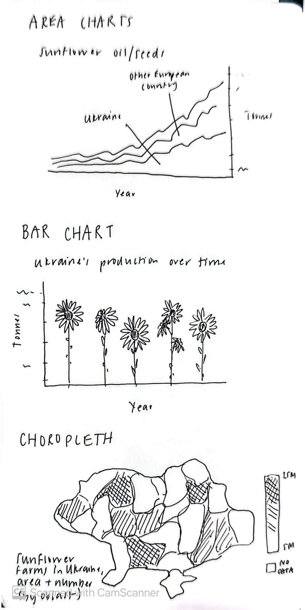

## Pre-Planning

**1. Restate the questions you hope to answer with your infographic. This should include one overarching question (think of this as driving the overall theme of your infographic) and at least three subquestions (each of which will be addressed by your infographic’s component visualizations). Have these questions changed at all since FPM #1? If yes, how so?**

Overarching question: Sunflowers are a significant part of Ukrainian culture, but how important are they to and how do they emerge across the country's agricultural economy?

-   Subquestion #1: How does Ukrainian sunflower oil and seed production compare to that of other European countries?

-   Subquestion #2: How has Ukraine's sunflower crop production changed over time?

-   Subquestion #3: How does sunflower production compare across different areas of Ukraine?

-   **2. Explain which variables from your data set(s) you will use to answer the above questions, and how.**

I have data on sunflower seed and oil production (in tonnes) for all European countries. Using this data, I will create an area chart that conveys the significance of Ukraine's contribution to the overall market. Using a different data set that predicts production for the 2025/2026 year, I will show the change in the country's production over time using a bar plot. Finally, with data on the number and size (in acres) of sunflower farms across Ukraine's oblasts (political units, equivalent to states), I will map the prevalence of sunflower agriculture in the country itself.

**3. In FPM #2, you created some exploratory data viz to better understand your data. You may already have some ideas of how you plan to formally visualize your data, but it’s incredibly helpful to look at visualizations by other creators for inspiration. Find at least two data visualizations that you could (potentially) borrow / adapt pieces from. Download and embed them into your drafting-viz.qmd file, and explain which elements you might borrow (e.g. the graphic form, legend design, layout, etc.).**

Choropleth Maps:

I like the following two choropleth examples that I found in the [R Graph Gallery](https://r-graph-gallery.com/choropleth-map.html). In the first, I liked how they formatted the map legend. Not only do I see myself borrowing the horizontal legend, but I also like the look of the angled labels. Finally, I was intrigued by the inclusion of a distribution dot plot paired with the legend. I'm not sure if it will be as effective with my data, but I am looking forward to trying.

```{r}
#| eval: true
#| echo: false
#| fig-align: "center"
#| out-width: "50%"
#| fig-alt: "Choropleth map depicting the sale price of agriculural land in France by region, with a discrete color bar and a depiction of data distribution below."
knitr::include_graphics("images/choropleth1.png")
```

In this second choropleth map, I liked the addition of the bar and scatter plots that visualize the same data in a different way. I wonder if I could categorize Ukraine's oblasts into geographic regions, and borrow this approach to highlight which areas and climates produce the most sunflowers.

```{r}
#| eval: true
#| echo: false
#| fig-align: "center"
#| out-width: "50%"
#| fig-alt: "An example choropleth highlighting three regions of the world -- North America, Europe, and Asia -- and showing how the data can be represented in a scatterplot and barplot."
knitr::include_graphics("images/choropleth2.png")
```

Bar Graph:

This chart from \[name name MEDS '25 Final Project\] uses images of flowers to show difference in value, instead of the traditional bars. I hope to adapt this approach, and do the same (but with sunflowers) for my graph that shows Ukraine's change in sunflower production over time.

```{r}
#| eval: true
#| echo: false
#| fig-align: "center"
#| out-width: "50%"
#| fig-alt: "Bar plot showing a bumblebee's favorite flowers in flower visits, with three bars, each represented by an image of the actual flower (Nuttall's Larkspur, Blue Thimble Flower, and Mountain Owl's Clover)."
knitr::include_graphics("images/image_barplot.png")
```

## Hand-drawn Anticipated Visualizations

The following are preliminary drawings of the visualizations included in this document.

```{r}
#| eval: true
#| echo: false
#| fig-align: "center"
#| out-width: "50%"
#| fig-alt: "Three example visualizations representing sunflower production in Ukraine: an area chart comparing its production to other European countries, a bar plot showing production change over time with sunflowers as bars, and a choropleth map showing the number and size of sunflower farms across the country, by oblast."

```

The text on the bottom left came out a bit blurry in the scan. It says: "Sunflower farms in Ukraine area and number (by oblast)."

## Recreation of Hand-Drawn Visualizations

```{r}
#| message: false
#| warning: false

# Load necessary libraries
library(tidyverse)
library(here)
library(ggplot2)
library(janitor)
library(showtext)
library(sf)
```

Load and access all of the necessary data.

```{r}
#| message: false

## Load sunflower production data

# create vector of only European countries
europe_countries <- c("Albania", "Andorra", "Austria", "Belarus", "Belgium", 
"Bosnia and Herzegovina", "Bulgaria", "Croatia", "Cyprus", "Czech Republic", 
"Denmark", "Estonia", "Finland", "France", "Germany", "Greece", "Hungary", 
"Iceland", "Ireland", "Italy", "Kazakhstan", "Kosovo", "Latvia", 
"Liechtenstein", "Lithuania", "Luxembourg", "Malta", "Moldova", 
"Monaco", "Montenegro", "Netherlands", "North Macedonia", "Norway", 
"Poland", "Portugal", "Romania", "Russia", "San Marino", "Serbia", 
"Slovakia", "Slovenia", "Spain", "Sweden", "Switzerland", "Turkey", 
"Ukraine", "United Kingdom", "Vatican City")

# sunflower oil
sunflower_oil <- read_csv(here("data", "production-of-sunflower-oil", "production-of-sunflower-oil.csv")) %>% 
  clean_names() %>% 
   filter(entity %in% europe_countries) %>% 
  
  # Add a column to denote when the observation is for Ukraine
  mutate(is_ua = case_when(
    entity == "Ukraine" ~ 1,
    TRUE ~ 0
  ))

# sunflower seeds
sunflower_seeds <- read_csv(here("data", "sunflower-seed-production.csv")) %>% 
  clean_names() %>% 
   filter(entity %in% europe_countries) %>% 
  
  # Add a column to denote when the observation is for Ukraine
  mutate(is_ua = case_when(
    entity == "Ukraine" ~ 1,
    TRUE ~ 0
  ))

## Farms by region data

# Load data and join attributes to geometries

# Ukraine geometry
oblasts <- read_sf("data/UA_FULL_Ukraine.geojson")
# Atttributes
by_region <- read_csv(here("data/by_region.csv")) %>% 
  mutate("name:en" = Region)

# Join on oblast name
sunflower_region <- left_join(oblasts, by_region, by = "name:en")


## Sunflower production data
sunflower_prod <- tribble(
  ~year, ~prod,
  "2020/21", 13900 * 1000,
  "2021/22", 16900 * 1000,
  "2022/23", 12680 * 1000,
  "2023/24", 15100 * 1000,
  "2024/25", 12100 * 1000,
  "2025/26", 11400 * 1000
)


## Ukraine's agriculture data, 2021
uki_agri_2021 <- tribble(
  ~export, ~tonnes, ~value,
  "Sunflower Oil", 5000000, 6400000000,
  "Maize", 23000000, 5900000000,
  "Wheat", 19000000, 5100000000,
  "Rapeseed", 2700000, 1700000000,
  "Barley", 5800000, 1300000000
)

# Source: https://www.europarl.europa.eu/RegData/etudes/BRIE/2024/760432/EPRS_BRI(2024)760432_EN.pdf#:~:text=By%20volume%20and%20value%2C%20Ukraine's%20main%20export,and%20barley%20(5.8%20million%20tonnes%2C%20US$1.3%20billion).
```

Create and save theme variables.

```{r}
# Load theme fonts
font_add_google(name = "Geist Mono", family = "geist_mono")
font_add_google(name = "Averia Serif Libre", family = "libre")
font_add_google(name = "Roboto", family = "roboto")

# Save theme colors
dark_yellow <- "#E7B030"
light_yellow <- "#f7d481"
uki_blue <- "#005BBB"
light_blue <- "#cbe1f5"

platinum <- "#F0F1F3"
inferno <- "#A30100"
honey_bronze <- "#F5AC45"
baltic_blue <- "#015E7C"
tropical_teal <- "#00AFB5"

reticulate::py_install("pyyaml")reticulate::py_install("pyyaml")
```

### Plot Type 1: Area Charts

```{r}
#| echo: false
#| fig-alt: "Area chart showing sunflower oil production in tonnes from 1992 to 2022, with Ukraine contributing about the third of production in Europe by 2022."
# avoid exponential notation in y-axis
options(scipen = 999)

showtext_auto(enable = TRUE)

sunflower_oil %>% 
  
  # create column with production tonnes scaled to be in millions
  mutate(sunflower_oil_prod_mil_tonnes = sunflower_oil_production_tonnes/1000000) %>% 
  
  # create plot
    filter(year > 1992) %>% 
  ggplot(aes(x = year, y = sunflower_oil_prod_mil_tonnes, group = entity, 
             fill = as.factor(is_ua))) +
  geom_area(color = alpha(uki_blue, alpha = 0.5), linewidth = 0.5) +
  labs(x = " ",
       # title = "Sunflower Oil",
       y = "Tonnes Produced (in millions)",
       # subtitle = "<b><span style='color:#FFF6B1;'>Production in Ukraine</span></b> has surged since 1995, with output being comparable<br>only to Russia's.",
       caption = "Data Source: Our World in Data") +
  theme_minimal(base_size = 17) +
  scale_fill_manual(values = c(light_blue, lighter_yellow)) +
  scale_y_continuous(position = "right", expand = c(0,0)) +
  annotate("text", x = 2017, y = 2.3, label = "Ukraine", size = 6, color = light_yellow, 
           family = "geist_mono") +
  annotate("text", x = 2019, y = 9.5, label = "Russia", size = 5.5, color = uki_blue,
           family = "geist_mono") +
  annotate("text", x = 1999, y = 13, label = "Sunflower Oil", size = 8, family = "libre") +
  theme(plot.background = element_rect(fill = "#B1D7FF"),
    panel.grid = element_blank(),
        legend.position = "none",
        plot.title = element_text(family = "libre",
                                  size = rel(0.99),
                                  margin = margin(b = 7)),
        plot.subtitle = ggtext::element_markdown(family = "roboto", size = rel(0.70)),
        axis.text.y.right = element_text(family = "geist_mono", size = rel(0.8), margin = margin(l = -15)),
        axis.text.x = element_text(family = "geist_mono", size = rel(0.8)),
        plot.caption = element_text(family = "roboto",
                                    margin = margin(t = 5),
                                    size = rel(0.45)),
        plot.caption.position = "plot",
        axis.title.y.right = element_text(family = "roboto", size = rel(0.60), margin = margin(l = 15))) +
        # panel.grid.minor.y = element_line(color = alpha("gray50", 0.5))) +
   scale_x_continuous(breaks = c(1995, 2000, 2005, 2010, 2015, 2020))

ggsave("sunflower_oil_area_2.pdf", width  = 8)

showtext_auto(enable = FALSE)
```

```{r}
#| echo: false
#| fig-alt: "Area chart showing sunflower oil production in tonnes from 1992 to 2022, with Ukraine contributing about the third of production in Europe by 2022."
# avoid exponential notation in y-axis
options(scipen = 999)

showtext_auto(enable = TRUE)

sunflower_seeds %>% 
  
   # create column with production tonnes scaled to be in millions
  mutate(sunflower_seed_prod_mil_tonnes = sunflower_seeds_production_tonnes/1000000) %>% 

    filter(year > 1992) %>% 
  ggplot(aes(x = year, y = sunflower_seed_prod_mil_tonnes, group = entity, 
             fill = as.factor(is_ua))) +
  geom_area(color = alpha(uki_blue, alpha = 0.5), linewidth = 0.5) +
  labs(x = " ",
       # title = "Sunflower Oil",
       y = "Tonnes Produced (in millions)",
       # subtitle = "<b><span style='color:#FFF6B1;'>Production in Ukraine</span></b> has surged since 1995, with output being comparable<br>only to Russia's.",
       caption = "Data Source: Our World in Data") +
  theme_minimal(base_size = 17) +
  scale_fill_manual(values = c(light_blue, lighter_yellow)) +
  scale_y_continuous(position = "right", expand = c(0,0)) +
  annotate("text", x = 2018, y = 6, label = "Ukraine", size = 6, color = light_yellow, 
           family = "geist_mono") +
  annotate("text", x = 2020, y = 25, label = "Russia", size = 5.5, color = uki_blue,
           family = "geist_mono") +
  annotate("text", x = 1999, y = 30, label = "Sunflower Seeds", size = 8, family = "libre") +
  theme(plot.background = element_rect(fill = "#B1D7FF"),
    panel.grid = element_blank(),
        legend.position = "none",
        plot.title = element_text(family = "libre",
                                  size = rel(0.99),
                                  margin = margin(b = 7)),
        plot.subtitle = ggtext::element_markdown(family = "roboto", size = rel(0.70)),
        axis.text.y.right = element_text(family = "geist_mono", size = rel(0.85), margin = margin(l = -15)),
        axis.text.x = element_text(family = "geist_mono", size = rel(0.85)),
        plot.caption = element_text(family = "roboto",
                                    margin = margin(t = 5),
                                    size = rel(0.45)),
        plot.caption.position = "plot",
        axis.title.y.right = element_text(family = "roboto", size = rel(0.60), margin = margin(l = 15))) +
        # panel.grid.minor.y = element_line(color = alpha("gray50", 0.5))) +
   scale_x_continuous(breaks = c(1995, 2000, 2005, 2010, 2015, 2020))

#ggsave("sunflower_seed_area_2.pdf")

showtext_auto(enable = FALSE)
```

```{r}
#|fig-alt: "Area chart showing sunflower oil production in tonnes from 1992 to 2022, with Ukraine contributing about the third of production in Europe by 2022."

showtext_auto(enable = TRUE)

sunflower_seeds %>% 
  
   # create column with production tonnes scaled to be in millions
  mutate(sunflower_seed_prod_mil_tonnes = sunflower_seeds_production_tonnes/1000000) %>% 

    filter(year > 1992) %>% 
  ggplot(aes(x = year, y = sunflower_seed_prod_mil_tonnes, group = entity, 
             fill = as.factor(is_ua))) +
  geom_area(color = alpha(uki_blue, alpha = 0.5), linewidth = 0.5) +
  labs(x = " ",
       title = "Sunflower Seed Production",
       y = "Tonnes Produced (in millions)",
       subtitle = "Other than Russia, Ukraine has only grown as the highest producer of sunflower\nseeds over the past few decades.",
       caption = "Data Source: Our World in Data") +
  theme_minimal(base_size = 17) +
  scale_fill_manual(values = c(light_blue, light_yellow)) +
  theme(panel.grid = element_blank(),
        legend.position = "none",
        plot.title = element_text(family = "libre",
                                  size = rel(0.99),
                                  margin = margin(b = 7)),
        plot.subtitle = element_text(family = "roboto", size = rel(0.70)),
        axis.text.y.right = element_text(family = "geist_mono", size = rel(0.8), margin = margin(l = -15)),
        axis.text.x = element_text(family = "geist_mono", size = rel(0.8)),
        plot.caption = element_text(family = "roboto",
                                    margin = margin(t = 20),
                                    size = rel(0.45)),
        plot.caption.position = "plot",
        axis.title.y.right = element_text(family = "roboto", size = rel(0.60), margin = margin(l = 15))) +
  scale_y_continuous(position = "right") +
   scale_x_continuous(breaks = c(1995, 2000, 2005, 2010, 2015, 2020))

ggsave("larger_axis_text_area_3.pdf", width = 8)

showtext_auto(enable = FALSE)
```

### Plot Type 2: Bar Chart

```{r}
#|fig-alt: "Bar plot showing the change in Ukrain's sunflower production from 2021/2022 to 2025/2026. Production has been gradually decreasing since 2023/2024, with some variation before then."

showtext_auto(enable = TRUE)

sunflower_prod %>% 
  mutate(prod_millions = prod/1000000) %>% 

ggplot(aes(x = year, y = prod_millions)) +
  geom_col(width = 0.05) +
  scale_y_continuous(expand = expansion(mult = c(0, 0.3))) +
  theme_minimal(base_size = 17) +
  labs(title = "Ukraine's Sunflower Seed Production Over Time",
       # subtitle = "Production is variable, with an observed decline after the start of the\nfull-scale Russian invasion in 2022.",
       x = " ",
       y = " ",
       caption = "Data Source: National Sunflower Association") +
  theme(plot.background = element_rect(fill = "#B1D7FF"),
        panel.grid.major.x = element_blank(),
        panel.grid.minor.y = element_blank(),
        panel.grid.major.y = element_line(linewidth = 0.5, color = uki_blue),
        legend.position = "none",
        plot.title = element_text(family = "libre",
                                  size = rel(0.99),
                                  margin = margin(b = 7)),
        plot.subtitle = element_text(family = "roboto", size = rel(0.70)),
        axis.text.y = element_text(hjust = 0, family = "geist_mono", size = rel(0.85)),
        axis.text.x = element_text(family = "geist_mono", size = rel(0.85)),
        axis.title = element_text(family = "roboto", size = rel(0.7)),
        plot.caption = element_text(family = "roboto",
                                    margin = margin(t = 20),
                                    size = rel(0.45)),
        plot.caption.position = "plot")

#ggsave("prod_bar.pdf", width  = 8)

showtext_auto(enable = FALSE)


```

I plan to use Affinity to add sunflowers to this bar chart (such as the image below), having them serve as the actual bars in the plot.

```{r}
#| eval: true
#| echo: false
#| fig-align: "center"
#| out-width: "25%"
#| fig-alt: "Image of a sunflower."
knitr::include_graphics("images/sunflower1.png")
```

### Plot Type 3: Choropleth Map

```{r}
#|fig-alt: "Map of Ukraine with oblasts colored by the number of sunflower farms. There tend to be more sunflower farms in southeast Ukraine, possibly due to warmer climate."
showtext_auto(enable = TRUE)

sunflower_region <- sunflower_region %>% 
  mutate(number_k = Number/10)

ggplot(data = sunflower_region) +
  geom_sf(aes(fill = Number), color = "white") +
  labs(title = "Number of sunflower farms",
       #subtitle = "There tend to be more sunflower farms in southeast Ukraine,\npossibly due to warmer climate.",
       fill = " ",
       caption = "Data Source: OneSoil.ai") +
  guides(fill = guide_colorbar(direction = "horizontal",
                               title.position = "top",
                               barheight = 0.75,
                               position = "bottom",
                               barwidth = 9)) +
   theme_void(base_size = 17) +
  # theme(legend.position = "bottom") +
  scale_fill_continuous(high = "#E7B030", low = platinum, na.value = alpha("#846E54", 0.25),
                        labels = scales::label_number(scale = 1e-2, suffix = " thousand")) +
  theme(plot.background = element_rect(fill = "#B1D7FF"),
        plot.margin = margin(t = 1, r = 1, b = 1, l = 1, unit = "cm"),
        plot.title = element_text(family = "libre",
                                  size = rel(0.99),
                                  margin = margin(b = 7)),
        plot.subtitle = element_text(family = "roboto", size = rel(0.70),
                                     margin = margin(b = 5)),
        legend.text = element_text(family = "geist_mono",
                                   size = rel(0.55)),
        plot.caption = element_text(family = "roboto",
                                    margin = margin(t = 20),
                                    size = rel(0.45)),
        plot.caption.position = "plot") 
  
  # add no data legend
  #annotate("rect", xmin = 38.5, xmax = 39.5, ymin = 45.6, ymax = 45.9, fill = "#cbe1f5") +
  #annotate("text", x = 38.5, y = 45.3, label = "No Data", hjust = 0, size = 3.1, family = "geist_mono")

ggsave("number_choropleth_2.pdf")

showtext_auto(enable = FALSE)
```

```{r}
#|fig-alt: "Map of Ukraine with oblasts colored by sunflower farm area. There tends to be more area allocated to sunflower production in southeast Ukraine, possibly due to warmer climate."

showtext_auto(enable = TRUE)

ggplot(data = sunflower_region) +
  geom_sf(aes(fill = Size), color = "white") +
  labs(title = "Size of sunflower farms in hectares",
       # subtitle = "Sunflower farms tend to cover more area in southeast Ukraine,\npossibly due to warmer climate.",
       fill = " ",
       caption = "Data Source: OneSoil.ai") +
  guides(fill = guide_colorbar(direction = "horizontal",
                               title.position = "top",
                               barheight = 0.75,
                               position = "bottom",
                               barwidth = 9)) +
   theme_void(base_size = 17) +
  scale_fill_continuous(high = "#E7B030", low = platinum, na.value = alpha("#846E54", 0.25),
                        labels = scales::label_number(scale = 1e-5, suffix = " ")) +
  theme(plot.background = element_rect(fill = "#B1D7FF"),
       plot.margin = margin(t = 1, r = 1, b = 1, l = 1, unit = "cm"),
        plot.title = element_text(family = "libre",
                                  size = rel(0.99),
                                  margin = margin(b = 7)),
        plot.subtitle = element_text(family = "roboto", size = rel(0.70),
                                     margin = margin(b = 5)),
        legend.text = element_text(family = "geist_mono",
                                   size = rel(0.55)),
        plot.caption = element_text(family = "roboto",
                                    margin = margin(t = 20),
                                    size = rel(0.45)),
        plot.caption.position = "plot") 
  
  # add no data legend
  #annotate("rect", xmin = 38.5, xmax = 39.5, ymin = 45.6, ymax = 45.9, fill = "#cbe1f5") +
  #annotate("text", x = 38.5, y = 45.3, label = "No Data", hjust = 0, size = 3.1, family = "geist_mono")

ggsave("size_choropleth_2.pdf")

showtext_auto(enable = FALSE)
```

### Plot Type 4: Donut Chart

```{r}
# Compute percentages
uki_agri_2021$fraction <- uki_agri_2021$value / sum(uki_agri_2021$value)

# Compute the cumulative percentages (top of each rectangle)
uki_agri_2021$ymax = cumsum(uki_agri_2021$fraction)

# Compute the bottom of each rectangle
uki_agri_2021$ymin = c(0, head(uki_agri_2021$ymax, n=-1))
 
# Make the plot
ggplot(uki_agri_2021, aes(ymax=ymax, ymin=ymin, xmax=4, xmin=3, fill=reorder(export, fraction))) +
     geom_rect() +
     coord_polar(theta="y") + # Try to remove that to understand how the chart is built initially
     xlim(c(2, 4)) + # Try to remove that to see how to make a pie chart
  theme_void()
```

```{r}
uki_agri_2021 %>% 
  ggplot(aes(x = export, y = value)) +
  geom_bar(stat = "identity") 
```

```{r}
#install.packages("remotes")
#remotes::install_github("hrbrmstr/waffle")

library(waffle)
uki_agri_2021 %>% 
  mutate(value = value / 1e8) %>% 
  ggplot(aes(fill = export, values = value)) +
  geom_waffle(tile_shape = "circle") +
  theme_void()
```

```{r}
# create color scheme
exports <- c("Sunflower Oil" = alpha(light_yellow, 1),
             "Maize" = alpha(dark_yellow,1),
             "Wheat" = alpha("#846E54",1),
             "Rapeseed" = alpha("#442824", 1),
             "Barley" = alpha("#007756", 1))


barely_backup <- "#776100"
rapeseed_backup <- "#6d7700"
wheat_backup <- "#00770a"

# adjust data
uki_agri_2021 <- uki_agri_2021 %>% 
  mutate(value_billions = value/100000000,
         tonnes_millions = tonnes/1000000,
         fraction = value_billions/(sum(value_billions))) %>% 
  mutate(n_squares = round(fraction * 100),
       remainder = (fraction * 100) - floor(fraction * 100)) %>%
arrange(desc(remainder)) %>%
mutate(n_squares = floor(fraction * 100) + 
         if_else(row_number() <= 100 - sum(floor(fraction * 100)), 1L, 0L)) %>% 
  mutate(export = factor(export, levels = c("Sunflower Oil", "Maize", "Wheat", "Rapeseed", "Barley"))) %>% 
  
  # forces the order!
  arrange(export)


showtext_auto(enable = TRUE)

# uki agri exports in value of US dollars
ggplot(uki_agri_2021, aes(fill = reorder(export, -value_billions), values = n_squares)) + 
  waffle::geom_waffle(n_rows = 10, radius = unit(0.5, "npc"), size = 0,
                      flip = TRUE, make_proportional = FALSE) +
  labs(fill = " ",
       title = "Ukraine's Top Export Products in 2021 (USD)",
       #subtitle = "Sunflower oil was the highest-valued export at $6.4 billion.",
       caption = "Data Source: European Parliamentary Data Service") +
  coord_equal() +
  theme_void(base_size = 17) +
  theme(plot.background = element_rect(fill = "#B1D7FF"),
        plot.title = element_text(family = "libre",
                                  size = rel(0.99),
                                  margin = margin(t = 8)),
        plot.subtitle = element_text(family = "roboto", size = rel(0.70),
                                     margin = margin(t = 4)),
        legend.text = element_text(family = "geist_mono",
                                   size = rel(0.4)),
        plot.caption = element_text(family = "roboto",
                                    margin = margin(t = 2, b = 5),
                                    size = rel(0.45)),
        plot.caption.position = "plot",
        legend.position = "none",
        legend.key.size = unit(0.3, "cm")) +
  scale_discrete_manual(values = exports, aesthetics = "fill") 

ggsave("waffle_chart_bright.pdf")

showtext_auto(enable = FALSE)
```

```{r}

showtext_auto(enable = TRUE)

# uki agri exports in tonnes of US dollars
exports_mass <- ggplot(uki_agri_2021, aes(fill = reorder(export, -tonnes_millions), values = tonnes_millions)) + 
  waffle::geom_waffle(n_rows = 10, radius = unit(0.5, "npc"), size = 0,
                      flip = TRUE) +
  labs(fill = " ",
       title = "By Mass (Tonnes)") +
  coord_equal() +
  theme_void() +
  theme(plot.title = element_text(family = "libre",
                                  size = rel(0.99),
                                  margin = margin(t = 8)),
        plot.subtitle = element_text(family = "roboto", size = rel(0.70),
                                     margin = margin(b = 0)),
        legend.text = element_text(family = "geist_mono",
                                   size = rel(0.55)),
        plot.caption = element_text(family = "roboto",
                                    margin = margin(t = 20),
                                    size = rel(0.45)),
        plot.caption.position = "plot") +
  scale_discrete_manual(values = exports, aesthetics = "fill")

showtext_auto(enable = FALSE)
```

Combine plots

```{r}
library(patchwork)
showtext_auto(enable = TRUE)

exports_mass + exports_value +
  plot_layout(guides = "collect")

showtext_auto(enable = FALSE)
```

```{r}
# uki agri exports in tonnes

ggplot(uki_agri_2021, aes(fill = reorder(export, -tonnes), values = tonnes)) + 
  waffle::geom_waffle(n_rows = 10, radius = unit(0.5, "npc"), size = 0) +
  labs(fill = " ") +
  coord_equal() +
  theme_waffle()
```

```{r}
df <- data.frame(
  export = c("Sunflower Oil", "Maize", "Wheat", "Rapeseed", "Barley"),
  value  = c(64, 59, 51, 17, 13)
)

ggplot(df, aes(fill = export, values = value)) +
  waffle::geom_waffle(n_rows = 10, size = 0.5, colour = "white", flip = TRUE) +
  scale_fill_manual(values = c(
    "Sunflower Oil" = "#f5c400",
    "Maize"         = "#e8852a",
    "Wheat"         = "#c8a96e",
    "Rapeseed"      = "#6a994e",
    "Barley"        = "#a7c4bc"
  )) +
  coord_equal() +
  labs(
    title = "Ukraine Agricultural Exports",
    caption = "1 square = $1 billion",
    fill = NULL
  ) +
  theme_void() +
  theme(legend.position = "bottom")

```

## Final Questions

**1. What are the key insights you want your infographic to communicate, and how will your design choices help highlight and support those messages?**

I want my infographic to communicate both the cultural and economic importance of sunflowers to Ukraine. Whereas my data will help highlight the country's role in the agricultural sector, I hope that my inclusion of sunflower imagery throughout the infographic (such as using them as bars in the bar chart, as well as embellishments throughout) will help develop the connection between the country and the flower. I also hope to implement the Ukrainian flag into the infographic (as I am already incorporating its colors), and convey that its design is representative of a yellow sunflower/wheat field (on the bottom) and a blue sky.

**2. What challenges did you encounter or anticipate encountering as you continue to build / iterate on your visualizations in R? If you struggled with mocking up any of your three visualizations, describe those challenges here.**

Although I figured out how to add a legend for the NA values in my choropleth map, I still find it awkwardly placed. I struggled with including it inline with the colorbar. Additionally, I think it will be difficult to add labels/a legend to the area chart that properly communicates that the yellow is Ukraine, and also notes some of the countries.

I feel like each of my visualization types is very distinct, and I am concerned about how I will cohesively and artistically include them all on one page. This will be made especially difficult by duplicate plot types for sunflower oil and seed production.

**3. What ggplot extension tools / packages do you need to use to build your visualizations? Are there any that we haven’t covered in class that you’ll be learning how to use for your visualizations?**

The only additional tool that I used which we didn't cover in class is the sf package, which I used to read in my geospatial data. Other than that, I mainly used the `theme()` and `annotate()` functionality in ggplot, with the addition of the showtext package to load in Google fonts to be implemented into my visualizations.

**4. What feedback do you need from the instructional team and / or your peers to ensure that your intended message and key insights are clear?**

Questions I hope to receive feedback on?

-   I really want to maintain the blue and yellow color scheme of the area charts, but I wonder if there is a way to both annotate the highest producers and keep Ukraine on the bottom in yellow. Should I try to rank the countries by production, for the last year in my plot? Also, I have been toying with the idea of removing Russia from the data, as only part of it is actually in Europe.

-   Like I mentioned previously, I found it difficult to implement a visually-appealing legend for the NA color in my choropleths. Is there a better way to do that?

-   Should I keep my y-axis scales consistent across plots? And if so, should I write them out as complete numbers (15000000) or shortened (15 million)?
